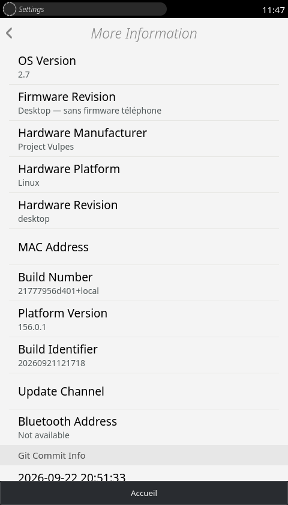

# Journal des évolutions — Vulpes OS

[English](CHANGELOG.en.md)

Une base Gaia, trois plateformes : **PC**, **Android (APK)** et **Tundra / Sargo**.
Ce journal décrit les changements visibles et les étapes techniques importantes.
Les rapports détaillés restent dans la documentation de chaque plateforme.

**Statuts :** « En développement » concerne les sources locales, « APK construit »
un paquet de test, et « Publié » une release accessible dans le dépôt. Un correctif
commun n’apparaît dans un APK installé ou une image téléphone qu’après leur mise à jour.

<em>Accueil et paramètres de Gaia · captures de la version pour ordinateur.</em>

## 8 octobre 2026 — Mise à jour des sources publiques

### Commun · PC / Android / Tundra

- Regrouper les correctifs récents de caméra, Contacts, SMS, Marketplace et les outils de construction et de restauration Sargo dans les sources publiques. Mettre à jour les README français et anglais avec les capacités et limites vérifiées.
- Corriger le contrôle de parité Android pour créer son dossier de rapports sur une copie neuve du dépôt. Vérifier que la configuration Wi-Fi native embarque un répertoire de connexions vide.
- Conserver les tickets, feuilles de route, documents internes, données personnelles et clés hors du dépôt.

### Paquets et qualification

- L’APK public reste Preview17 : les correctifs du 8 octobre nécessitent une prochaine compilation. Aucune nouvelle image native publiée ni flash dans cette étape.
- Sur Sargo, l’enregistrement cellulaire reste en recherche lors du dernier contrôle ; audio bidirectionnel, appairage Bluetooth et profils restent à qualifier.

## 8 octobre 2026 — Caméra et parcours Contacts · en développement

### Commun · Gaia / PC / Android / Tundra

- Sérialiser les ouvertures de caméra, attendre la fermeture du capteur précédent et libérer les pistes et ressources vidéo même après un échec. Stabiliser l’identification avant/arrière sur PC et Android.
- Conserver les images binaires lors des échanges PC/Tundra ; encoder explicitement les photos et dates des contacts pour le pont JSON Android.
- Corriger l’actualisation de la fiche après modification d’un contact. Rétablir les activités Contacts → SMS, sélection d’un numéro et ouverture du pavé numérique, en préservant les demandes imbriquées et les points d’entrée de Gaia.
- Réouvrir Galerie en mode sélection pour ajouter une photo à un contact, même lorsque Galerie est déjà ouverte en consultation. Sélection, recadrage et enregistrement de la photo validés sur PC.
- Ajouter des tests de caméra, de stockage des contacts, de permissions, de transport binaire et de routage des activités.

### PC

- Vérifier le parcours original Appareil photo → capture JPEG → Galerie → ouverture de la photo → retour caméra.
- Vérifier dans Gaia : création et modification d’un contact, actualisation de la fiche, recherche sans accents et sans résultats, favoris, destinataire SMS, sélection d’un numéro, pavé numérique prérempli, annulation puis confirmation de suppression. Le test n’émet ni appel ni SMS et supprime son contact temporaire.

### Tundra · Sargo

- Vérifier en RAM sur Pixel 3a : autofocus, zoom, quatre alternances avant/arrière avec nouvelles trames, capture JPEG depuis Gaia, stockage, ouverture dans Galerie et arrêt du capteur à l’accueil.
- Vérifier les conversations déjà stockées, le clavier et les notifications. Recherche Wi-Fi : quatre réseaux détectés. Nouvelle émission/réception SMS et audio des appels encore en qualification.
- Ajouter les paquets BlueZ et les bibliothèques nécessaires, verrouillés par SHA256. Le contrôleur Bluetooth démarre, s’active et lance une recherche ; l’appairage depuis Gaia et les profils ne sont pas encore validés.
- Ajouter le magasin de certificats natif : HTTPS vérifié sans désactivation de TLS. Tester les archives altérées, collisions de fichiers et reconstructions répétées.

- Corriger les fichiers Contacts embarqués dans le build de démarrage : la création, l’édition, le passage vers SMS, le sélecteur et le pavé numérique passent aussi avec les gestes tactiles sur Sargo.

### Android · APK

- Publier l’APK Preview17 existant, avec téléchargement et SHA256 vérifiés. Il précède les correctifs du 8 octobre.
- Corriger la transmission des destinataires et du texte de Gaia vers l’application SMS Android, y compris la réponse à une conversation et le numéro saisi sans validation préalable. Tests du pont réussis ; essai Android réel encore nécessaire.
- Réempaqueter les ressources communes corrigées pour la prochaine compilation ; aucun nouvel APK incluant ces correctifs n’est publié.

**État :** builds natifs de qualification démarrés en RAM. Aucun flash, push de code ni publication de documentation privée dans cette étape. La qualification complète des fonctions de téléphone reste ouverte.

## 6 octobre 2026 — Thème Marketplace intégré · en développement

### Commun · Gaia / PC / Android / Tundra

- Ouvrir le catalogue avec `mode=app`, conservé dans les liens, la recherche, les filtres, les fiches et le changement de langue.
- Préparer un thème web Vulpes dédié : Fira locale, navigation compacte, boutons tactiles, cartes lisibles, filtres repliables et captures défilantes. Retirer les en-têtes du site dans le mode intégré, tout en conservant l’interface du site classique.
- Conserver les confirmations et messages système côté Gaia. Le thème ne donne aucun privilège supplémentaire aux pages du catalogue.
- Vérifier 16 pages FR/EN, 2 pages en mode classique et les ressources du thème. Rendus mobiles de 320 et 360 pixels inspectés. Lanceurs PC et Sargo mis à jour ; les sources seront reprises au prochain empaquetage Android.

Fichiers du site prêts localement, non déployés sur le serveur public. Aucun push ni nouvelle publication APK/ROM.

## 6 octobre 2026 — Bandeaux Gaia · en développement

### Commun · Gaia / PC / Android / Tundra

- Faire disparaître le bandeau « Application installée » après son délai normal, même si la fin d’animation ne remonte pas du composant Gaia. Conserver son apparence et permettre sa fermeture au toucher.
- Annuler les anciens délais lorsqu’un nouveau message remplace le précédent pour éviter une disparition prématurée.
- Vérifier sur PC l’affichage, l’expiration, le remplacement et la fermeture au clic ; vérifier sur le Pixel le retrait effectif du bandeau après cinq secondes. Correctif déployé sur l’essai Sargo en RAM et disponible dans les sources communes pour le prochain APK.

Aucun flash ni publication dans cette étape.

## 6 octobre 2026 — Wi-Fi et panneaux Paramètres · en développement

### Commun · Gaia / PC / Android / Tundra

- Terminer l’ouverture d’un panneau Paramètres même si Gecko ne produit pas l’événement de fin d’animation. Conserver les transitions Gaia et éviter les doubles initialisations.
- Correctif dans les sources communes et le serveur PC ; inclus au prochain empaquetage Android. Aucun nouvel APK publié dans cette étape.

### Tundra · Sargo

- Corriger les événements de signal Wi-Fi : transmettre le réseau associé et ne pas annoncer de signal de connexion lorsque le téléphone est déconnecté. L’événement incomplet faisait échouer l’affichage des réseaux dans Gaia.
- Sur le Pixel, vérifier le pilote, le service natif, le passage par Gecko et l’affichage du panneau corrigé : quatre points d’accès détectés, regroupés en deux réseaux, sans erreur de recherche.
- Connexion Wi-Fi confirmée par l’utilisateur ; requête HTTPS réelle réussie depuis Gecko vers example.org (HTTP 200, vérification des certificats active). Correctifs appliqués à l’essai en RAM ; aucun flash ni push.

## 6 octobre 2026 — Marketplace · en développement

### PC / Tundra · Sargo

- Maintenir le catalogue sous la barre de statut et dans les limites de son application. Masquer sa vue web à l’accueil et dans le multitâche ; la retirer à la fermeture de l’application.
- Éviter qu’une navigation annulée ou l’ancienne page d’erreur masque une nouvelle tentative.
- Afficher un message local et proposer une nouvelle tentative lorsque le catalogue est inaccessible, au lieu de laisser sa page d’erreur recouvrir Gaia.
- Sur PC : navigation, erreur réseau, nouvelle tentative, retour à l’accueil et fermeture depuis le multitâche vérifiés. Sept contrôles directs passent sur Sargo en RAM, sans fenêtre de débogage, avec une page locale et une précondition de déverrouillage forcée ; le catalogue distant nécessite une connexion Internet sur le téléphone.

### Android · APK

- Reconstruire l’APK local Preview17 avec le message d’erreur Marketplace commun. Signature, alignement et parité des ressources vérifiés ; nouvelle régression sur appareil Android non effectuée dans cette étape.

Aucune publication dans cette étape.

## 2.7-preview.17 — APK construit · 5 octobre 2026

### Commun · Gaia / PC

- Remettre Marketplace sur l’accueil avec son icône originale et le catalogue Vulpes. Ouvrir sa version française pour les langues fr, anglaise sinon.
- Adapter les téléchargements du catalogue en installations confirmées : vérifier les archives ZIP, ajouter l’application à l’accueil et permettre son lancement et sa désinstallation.
- Conserver les applications installées séparément des sources Gaia, sur des origines distinctes et sans privilèges système hérités des anciens manifestes.
- Valider sur PC le parcours réel avec 2048 : catalogue, confirmation, installation, lancement, persistance et désinstallation. Contrôler les archives corrompues, chemins invalides, limites, annulation et confirmations à usage unique.

### Android · APK

- Construire et signer Preview17 avec le même Marketplace et le même service d’installation. Utiliser la vue GeckoView existante pour le catalogue et le stockage privé Android pour les paquets.
- Vérifier sur émulateur Android 16/API36 le clic Installer, la confirmation, l’apparition sur l’accueil et le lancement de 2048 sans accès au pont système Vulpes. Vérifier aussi la conservation après arrêt forcé et relance, puis la désinstallation.

### Tundra · Sargo

- Préparer une image de boot locale incluant Marketplace, l’installateur et le serveur des applications ajoutées. Démarrage en RAM effectué sur le Pixel le 6 octobre : accueil et ressources Marketplace vérifiés, sans flash. Neuf contrôles système sur dix passent ; le contrôle global Gaia relève une variation du viewport au déverrouillage. Installation de paquets sur Sargo encore à qualifier.

**Limites :** compatibilité initiale avec les applications web empaquetées. Les anciennes API privilégiées, applications hébergées et services disparus ne sont pas restaurés automatiquement. Rien publié sur Forgejo ni sur le site.

## 2.7-preview.16 — APK construit · 5 octobre 2026

### Commun · Gaia / PC

- Rétablir les sélecteurs Gaia de fond d’écran et de sons, leur retour vers Paramètres et leur annulation par Accueil. Partager le transport des images et sons enregistrés entre PC et Android.
- Propager les changements de langue à l’accueil, y compris sans permission de lecture générale des réglages. Vérifier les libellés FR/EN et la persistance.
- Rétablir l’arrêt du balayage horizontal sur une page et masquer les applications de développement sur l’accueil, sans les supprimer des sources.
- Utiliser le logo Vulpes fourni dans le splash et adapter les composants originaux de la liste des sons au moteur actuel.
- Vérifier sur PC deux changements consécutifs de fond, le choix d’un son et les panneaux Gaia restaurés.

### Android · APK

- APK local Preview16 construit et signé ; contenu commun et version vérifiés. Aucune publication dans cette étape.
- Valider Vulpes comme lanceur HOME, afficher le verrouillage Gaia après veille et rétablir le retour Android depuis la caméra ouverte au verrouillage.
- Masquer les barres système Android en mode immersif, en conservant leur accès temporaire par balayage.
- Tests sur émulateur Android 16/API36 : verrouillage, caméra/retour, FR/EN, accueil sans applications de test, fond d’écran et son. Fond conservé après arrêt forcé et relance, sans changement répété pendant 15 secondes. Autres appareils Android non qualifiés dans cette étape.

### Tundra · Sargo

- Inclure les mêmes correctifs et la politique des applications dans une nouvelle image de boot de test. Le boot précédent réappliquait une copie ancienne des fichiers et annulait les modifications à chaud.
- Démarrage en RAM sur le Pixel réussi : six contrôles de langues/accueil/sélecteurs et dix contrôles système passent. Sélecteurs image/son vérifiés sans écraser les choix personnels. Le boot installé reste Preview15 ; aucune partition flashée dans cette étape.

**Limites :** l’installation tierce FFAA reste ouverte. Le site dépend d’anciennes API mozApps et d’un script nomodule ; un installateur isolant les applications et leurs permissions reste à construire. Le choix d’un son Gaia ne modifie pas la sonnerie globale Android ; l’audio d’appel réel n’a pas été qualifié ici.

## En développement — 4 octobre 2026 — Installation autonome Sargo

### Tundra · Sargo

- Construction d’un volume ext4 neuf directement destiné à userdata : système, données et composants matériels vendor/modem embarqués. Le démarrage ne cherche plus de fichiers dans une installation Droidian ; aucune session Android ni connexion ADB n’est nécessaire à l’installation.
- Installateur Fastboot en Python : contrôle du modèle Sargo, du déverrouillage, des tailles et des empreintes, puis remplacement de userdata, dtbo_a, vbmeta_a et boot_a. Le bootloader reste déverrouillé ; les calibrations propres au téléphone sont conservées.
- Sauvegarde complète de userdata hors ligne, comparaison intégrale avec le téléphone et vérification de l’archive de restauration avant le flash. Les sauvegardes restent privées ; une restauration réelle n’a pas été effectuée dans cette étape.
- Deux démarrages depuis le stockage interne réussis : onze contrôles Gaia et dix contrôles natifs par démarrage, image de boot relue et vérifiée, réglages conservés. Le slot A est marqué réussi uniquement après validation du démarrage Gaia courant.
- Variante générique sans serveur SSH ni clés de maintenance : flash de boot_a et démarrage réel réussis. La variante de développement est ensuite remise sur le Pixel pour poursuivre les travaux. Les images du paquet générique conservent leur état initial vierge.
- Contrôles finaux sur le démarrage autonome de développement : Photo (dont bascules de capteur), clavier Gaia et notifications réussis.
- Paquet Fastboot local assemblé avec empreintes et rapport de qualification. 44 tests ciblés passent. Il n’est pas encore publié : la provenance et la redistribution de certains composants matériels restent à finaliser.
- Limites : qualification sur un Pixel 3a, pas sur toutes les combinaisons de firmware ; volume de 8 Gio comprenant 1 Gio de données modifiables, sans extension automatique. Les fonctionnalités matérielles restent expérimentales.

### PC / Android · APK

- Aucun changement d’interface ni nouveau binaire dans cette étape. Gaia reste partagé entre les trois plateformes.

## En développement — 3 octobre 2026 — Installation Sargo par appareil

### Tundra · Sargo

- Collecte des six partitions de démarrage en lecture seule et du stockage existant, liés à l’identité du téléphone et au slot A. Les sauvegardes restent privées.
- Dossier appareil portable : construction RAM, contrôle du boot, installation et export du secours peuvent l’utiliser sans l’inventaire partagé du Pixel de développement. Un build lié à un dossier appareil refuse le repli implicite vers cet inventaire.
- Transfert SSH contrôlé : vérification de l’identité et du stockage, contrôle des empreintes et création des fichiers sans remplacer les données existantes. Aucun formatage, flash ou redémarrage dans l’outil de transfert.
- Construction et transfert testés sur le Pixel. Premier boot RAM : onze contrôles Gaia et dix contrôles natifs réussis ; clavier et notifications réussis. Le contrôle caméra a rencontré un délai d’autofocus dépassé, conservé dans le rapport.
- Second boot de la même image : réglage Gaia conservé, onze contrôles Gaia et dix contrôles natifs réussis ; caméra, clavier et notifications réussis. Le timeout autofocus du premier essai reste documenté, pas déclaré corrigé.
- Retour au build installé vérifié : démarrage Gaia réussi et partition de boot inchangée. Un nouveau transfert refuse bien de remplacer les données déjà utilisées.
- Provenance du HAL précisée : paquet et recette de téléchargement identifiés, recettes UBports historiques récupérées. La correspondance exacte avec l’ancien artefact Android et son manifeste de sources reste à établir.
- Prise en charge toujours limitée au noyau qualifié et au stockage ext4/LVM compatible. Ce travail ne fournit pas encore une installation directe depuis Android d’origine.

### PC / Android · APK

- Aucun changement d’interface ni nouvelle compilation dans cette étape.

## En développement — 3 octobre 2026 — Préparation et secours Sargo

### Tundra · Sargo

- Ajout d’un outil de préparation locale : contrôle du manifeste et de l’archive, décompression bornée, vérification ext4 et création d’un espace de données vierge propre à l’installation. Les dossiers existants ne sont pas écrasés.
- Ajout d’un kit de restauration privé exportable hors du dépôt. Il conserve la sauvegarde originale de boot_a et un outil autonome qui vérifie le modèle, le numéro de série, le slot et les empreintes avant toute restauration explicite. Il ne constitue pas une sauvegarde des données utilisateur.
- La restauration existante ne dépend plus de la présence de l’image de diagnostic. Les contrôles de la sauvegarde sont conservés.
- Construction système : référence matérielle ARM64 désormais explicite, avec refus d’une référence limitée à l’affichage ou dépourvue des services requis.
- Préparation de l’archive système réelle et vérification locale du kit de secours effectuées. Aucun nouveau flash ni nouvelle ROM publiée ; l’installation automatique sur un autre Sargo reste à finaliser.

### Commun · PC / Android / Tundra

- Le journal JSON partagé est conservé dans les futures publications de sources ; les documents de travail Markdown restent exclus.

### PC / Android · APK

- Aucune modification fonctionnelle ni nouvelle compilation dans cette étape.

## En développement — 3 octobre 2026 — Sargo : récupération modem et installation vierge

### Tundra · Sargo

- Reconstruction de l’image système avec le correctif du cache des polices et la création du répertoire privé d’oFono au premier démarrage.
- Récupération limitée au sous-système modem : test contrôlé avec passage hors ligne, remise en service et réenregistrement réseau en environ 22 secondes, sans redémarrage du téléphone. Cela ne corrige pas la cause du watchdog IMS du firmware.
- Démarrage Gaia, rendu matériel, polices Fira, deux capteurs photo, focus/zoom, clavier et notifications visuelles contrôlés sur le profil neuf. Scan Wi-Fi encore fonctionnel après le redémarrage du modem.
- Deux démarrages réussis avec conservation du même réglage Gaia sur un espace de données séparé. Caméra, clavier et notifications revérifiés au second démarrage. La partition de boot installée et les données existantes sont conservées.
- Aucune nouvelle image native publiée : le paquet public d’installation/restauration reste à terminer.

### PC / Android · APK

- Aucun changement de l’interface commune ni nouvelle compilation APK dans cette étape.

## 1er octobre 2026 — Sargo : préparation de la distribution — en développement

### Tundra · Sargo

- Image système Preview 15 reconstruite avec profils vierges, exclusion des documents de travail et conservation des licences ; inventaire des 493 paquets embarqués.
- Vérification ext4 et contrôle du contenu effectués. Ces contrôles ne constituent pas une validation de démarrage.
- Inventaire du stockage en lecture seule et génération de la table de montage depuis cet inventaire, au lieu de reprendre systématiquement les dimensions du Pixel de développement. Prise en charge limitée au volume ext4 à une seule étendue sur userdata Sargo ; aucun formatage ajouté.
- Image nettoyée transférée et vérifiée sur le Pixel chargé. Essais temporaires en RAM, sans écriture de boot_a ; retour automatique vers le build v59 et redémarrage de Gaia contrôlés.
- SIM reconnue, enregistrement LTE et scan Wi-Fi contrôlés sur cette image ; ces contrôles ne valident pas les appels, SMS ou données mobiles de bout en bout.
- Correction des droits du cache des polices au premier démarrage : fc-cache utilise le compte de session. Démarrage Gaia, rendu matériel, Fira, deux capteurs photo, clavier et notifications visuelles contrôlés en RAM. La qualification du fichier reconstruit reste incomplète.
- Redémarrage intermittent identifié dans le firmware IMS du modem ; politique de récupération ciblée appliquée et second démarrage avec LTE, caméra, clavier et notifications réussi. La récupération après un nouveau crash IMS reste non testée. L’image publique reste non flashable et non publiée.

### PC / APK

- Aucun changement fonctionnel ni nouvelle compilation APK dans cette étape.

## 2.7-preview.15 — 30 septembre 2026 — publiée

[Release](https://nnsprod.com/git/oversu/VulpesOS/releases/tag/v2.7-preview.15)

### Commun · Gaia / PC / Android / Tundra

- Première publication des sources communes, avec README français et anglais, licences et scripts de préparation. Documentation interne, roadmap, profils, clés et images privées exclus du dépôt public.
- Intégration des derniers correctifs SMS (dates des bulles, états d’envoi/échec) et du cycle de vie caméra. Les deux entrées du 30 septembre détaillent les correctifs matériels.

### PC

- Copie de publication testée avec moteur Gecko 156.0.1 et profil neuf : démarrage Gaia, navigation, réglages, gestes, historique et isolation des pages. 42 tests de services passants ; persistance des services après redémarrage vérifiée.
- Stabilisation du test de navigation lors du remplacement normal d’un document et allongement de l’attente de démarrage à froid. Fermeture propre de l’hôte même si Gaia dépasse le délai de préparation.

### Android · APK

- Preview 15 signée avec la clé des précédentes Preview, GeckoView 156.0 ; parité des ressources communes vérifiée. Mise à jour installée sur émulateur Android 16.
- Photo et Galerie : capture, affichage et reprise du capteur validés. Dix passages en arrière-plan et récupération après arrêt du processus d’affichage validés. Cette qualification ne couvre pas tous les téléphones Android.

### Tundra · Sargo

- Sources du runtime incluses ; l’image privée v59 reste celle qualifiée sur le téléphone de développement. Aucune ROM générique flashable publiée : démarrage encore lié au stockage inventorié, aux images préinstallées et aux accès de maintenance privés.
- Limites conservées : aperçu caméra proche de 16 i/s, flash/vidéo, rotation et veille profonde incomplets ; audio d’appel à qualifier et grand dialogue après envoi SMS à identifier.

## En développement — retours SMS et caméra · 30 septembre 2026

### Commun · Gaia / PC / Tundra

- SMS : convertir les dates en nombres avant de construire les bulles. Corrige les conversations vides dues à une erreur de formatage de date. Parcours du compositeur et affichage des messages envoyés/reçus vérifiés sur PC avec un modem simulé.
- Photo : fermeture du flux rendue idempotente; détacher les vidéos, attendre la libération du capteur et libérer le contexte WebGL avant de changer de caméra. Identifier chaque session pour qu’un ancien flux ne puisse pas arrêter son remplaçant. Allers-retours arrière/avant vérifiés avec de nouvelles trames à chaque bascule; retour Accueil et arrêt du capteur validés lors de deux démarrages RAM.

### Tundra / Sargo

- Vibreur : utiliser le contrôle brightness du pilote DRV2624; la commande legacy activate ne coupait pas physiquement le moteur. Coupure confirmée par l'utilisateur; impulsion, motif 200/200/200 ms et arrêt du service vérifiés, avec retour à zéro. Ajouter une coupure de secours au démarrage et à la sortie du service.
- L'utilisateur confirme focus, zoom et transport SMS dans les deux sens sur v54. Cinq conversations existantes affichées sur le Pixel, avec leurs bulles et sans erreur de date.
- v59 installé sur boot_a après deux démarrages RAM réussis; démarrage installé et relecture vérifiés, slot A marqué réussi. Sources et runtime PC synchronisés. Le grand dialogue après un envoi réel reste à identifier; la fluidité caméra reste un chantier distinct.

### Android · APK

- Sources Gaia communes corrigées; aucun nouvel APK construit ou publié.

## En développement — SMS et Photo · 30 septembre 2026

### PC / Tundra

- SMS : conserver le message et sa conversation après un refus du modem; transmettre les événements Gaia « envoi », « échec » et « envoyé ».
- SMS : distinguer mise en file oFono et confirmation d'envoi, avec suivi persistant des états terminaux. La confirmation modem n'est pas un accusé de réception du destinataire.
- PC : tests de l'échec d'envoi visible dans la liste des conversations; Photo et Galerie testées avec capture tactile, ouverture, fermeture et reprise de la caméra.

### Tundra / Sargo

- Photo : raccorder les zones de focus tactile, le zoom numérique et la capture JPEG du capteur à l'interface Gaia originale. Aperçu conservé en 640 × 480; JPEG arrière 4032 × 3024 (12,19 Mpx) et avant 3264 × 2448 (7,99 Mpx) mesurés directement. Focus fixe à l'avant.
- Protocole caméra : séparer les traces du HAL des données binaires, borner les réponses et relancer l'aperçu après une capture. Une erreur de focus ne doit plus fermer la session.
- SMS : refuser explicitement l'envoi si le modem n'est pas enregistré; conserver les états sent/failed même après disparition de l'objet oFono. La réception a produit des notifications opérateur sur v49 après retour du réseau LTE.
- Qualification : deux démarrages v54 en RAM puis démarrage depuis boot_a validés; image installée sur le Pixel et slot marqué réussi après relecture. Persistance, interface Gaia et tests caméra passants. L'enregistrement réseau reste instable : essais SMS arrêtés avant émission, aucune livraison de bout en bout confirmée.

### Android · APK

- Aucun nouvel APK construit ou publié dans cette passe. La Preview 14 disponible reste inchangée.

## 2.7-preview.14 — APK publié · 30 septembre 2026

[Release](https://nnsprod.com/git/oversu/VulpesOS/releases/tag/android-2.7-preview.14)

L’APK Preview 14 est publié. La version PC est à jour et le build privé Sargo v48 est installé et testé ; aucune image téléphone n’est publiée avec cette release.

### Commun · PC / APK / Gaia

- Informations : suppression du retrait supplémentaire des lignes de version avant « Dernière mise à jour » ; alignement contrôlé sur PC et Android.
- Polices : normalisation des noms de fontes dans les feuilles des composants Shadow DOM, y compris les styles ajoutés après leur création. Les polices d’icônes restent distinctes.
- Calendrier : ouverture du mois et absence d’erreur JavaScript vérifiées sur PC.

### PC / Tundra

- Clavier : calculer le mode portrait depuis l’écran, et non depuis la petite fenêtre du clavier. Touches de 60 px CSS environ sur Pixel ; rotation et retour au portrait testés sur PC à densité 3.
- SMS : replacer le curseur dans le champ actif lorsque Gecko conserve la sélection du destinataire ; conserver les sélections valides pour l’édition.
- Notifications Gaia : respecter les indicateurs silencieux, sans son et sans vibration, y compris à la restauration.

- Clavier Gaia : pont de saisie natif, pavé numérique pour les destinataires SMS, événements de sélection corrigés et protection contre les réponses d’un champ devenu inactif. Saisie destinataire et message testée sur PC et Pixel ; l’envoi opérateur reste à qualifier.
- Verrouillage : accepter l’absence de fenêtre clavier lors d’un redimensionnement.
- Notifications natives : stockage, propriété par application et ouverture du point d’entrée Téléphone déclaré par Gaia. Présentation et suppression dans le volet et sur le verrouillage validées sur Sargo ; écoute du son à qualifier.

### Tundra / Sargo — build v48 installé

- Vibrations : pont vers le moteur Sargo, motifs bornés à dix secondes, séquencement sans bloquer les boutons physiques et annulation. Activation et arrêt mesurés sur le pilote.

- Wi-Fi : profils privés conservés avec reconnexion automatique et commande d’oubli ; tests du stockage et de la restauration en cas d’échec. Connexion et reconnexion après redémarrage RAM vérifiées sur Sargo ; fichiers de profil privés (0600).
- SMS entrants : stockage persistant avant acquittement, dédoublonnage des reprises et services créant leur dossier d’état au démarrage. Défaut de montage du dossier corrigé après reproduction sur Sargo.
- Audio : commandes écouteur/haut-parleur, micro et volume d’appel ajoutées au pont ; bascule écouteur/haut-parleur, sourdine et volume vérifiés sans appel. Conversation dans les deux sens encore à vérifier.
- Images de diagnostic avec débogueur local interdites au flash par l’outil d’installation. v48/preview.14 écrite sur boot_a après deux démarrages RAM et contrôle de persistance ; démarrage installé validé, image relue conforme et slot A marqué réussi. v43 à v48 n’activent pas de débogueur.

### Android · APK

- APK preview.14 construit, signé et publié sur Forgejo. Démarrage, informations de version, alignement et sélection des fontes des composants contrôlés sur Android 16 émulé. Le clavier Android reste celui du système.

## 2.7-preview.13 — parcours dans les applications · 27 septembre 2026

### Commun · Gaia / PC

- Calendrier : une alarme planifiée avec succès ne provoque plus un rejet lors de la sauvegarde de l’événement; les erreurs de planification sont transmises au demandeur.
- Rappels : ignorer ceux d’événements supprimés; ne plus marquer une notification refusée comme livrée. La prise en charge des notifications natives Tundra reste à terminer.
- Notifications : accepter un texte brut vide sans chercher une traduction « undefined ».
- Galerie : vignettes de taille positive même au démarrage masqué; annulation des mises à jour d’aperçu après fermeture de l’éditeur.
- SMS : appliquer les filtres correspondant, lu/non lu, période et livraison; tests de lecture et suppression des conversations.
- Revue approfondie : lecture, déplacement et suppression d’une vidéo WebM; édition noir et blanc et copie d’une photo; création et suppression d’un événement. Interfaces Gaia originales conservées.

- Qualification depuis une copie isolée : démarrage, tests bureau, persistance et empaquetage Android réussis sans réécriture des sources.

### Android · APK

- APK preview.13 construit et signé; Photo/Galerie, Calendrier, dix retours d’arrière-plan et récupération du rendu validés sur Android 16 émulé.

### Tundra · Sargo

- Build v40/preview.13 installé après deux démarrages RAM : Gaia, caméra, Wi-Fi, luminosité et commandes contrôlés; relecture de boot_a conforme et slot validé. Limites restantes dans `docs/APPLICATION-REVIEW.md`.

## 2.7-preview.12 — revue des applications · 27 septembre 2026

### Commun · Gaia / PC

- Icônes internes : variantes raster Gaia originales de 1× à 2,25× rétablies dans
  1 047 références CSS. Les icônes vectorielles et les polices restent originales.
- Photo : bouton de changement de capteur réactivé après découverte des caméras;
  flash indisponible visible et grisé; le pincement ne zoome plus le document Gaia.
- Accueil : gestes natifs réservés au bouton pendant l’appui long; menu contextuel
  désactivé sur ce bouton. Le gestionnaire des tâches Gaia reste utilisé.
- Transmission des gestes entre System et les applications restaurée avec des
  événements DOM non privilégiés, sans autoriser de faux gestes sur les sites Web.
- Navigateur : intégration de la page `browser-welcome` fournie, locale, bilingue,
  sans suivi; recherches et liens transmis au véritable navigateur.
- Page d’accueil : suit automatiquement la langue Gaia, `fr`/`fr-*` en français,
  les autres en anglais; changement appliqué sans redémarrage.
- SMS : identifiants compatibles avec le registre numérique Gaia, migration des
  anciens messages, dates de l’API et événement d’envoi corrigés; écritures sérialisées.
- Calendrier : libellé d’accessibilité du jour courant retrouvé dans 37 langues.
- Revue de 14 applications; 26 contrôles fonctionnels Galerie/Musique/Horloge/UI,
  tests Contacts et SMS, et navigation Web isolée. Voir `docs/APPLICATION-REVIEW.md`.

### Android · APK

- APK `2.7-preview.12` : même interface, correctifs et page locale; reconstruction
  et parité contrôlées. L’accès caméra reste celui d’Android via getUserMedia.
- Aucun portage automatique des fonctions matérielles Tundra vers Android : chaque
  plateforme conserve son adaptateur et annonce ses capacités réelles.

### Tundra · Sargo

- Aperçu Photo : conversion NV21 par shader, transport binaire au lieu de base64;
  environ 23 images/s mesurées en RAM contre environ 8 dans l’essai intermédiaire.
- Fermeture du worker attendue avant de rouvrir un autre capteur.
- Luminosité manuelle : retrait des animations successives, environ 200 ms pour
  atteindre la valeur demandée lors du test matériel; transitions veille/réveil conservées.
- Wi-Fi : état radio réel et activation/désactivation raccordés aux réglages Gaia;
  réseau mixte WPA2/WPA3 compatible avec le formulaire WPA-PSK.
- Scan par Gaia, connexion et navigation HTTPS par wlan0 validés en RAM. Les
  profils de connexion restent temporaires; leur persistance est encore à réaliser.
- Image v38 installée : deux démarrages RAM, démarrage installé, relecture de
  `boot_a`, préservation des autres partitions et validation du slot A réussis.
- Flash photo, vidéo, capteur de luminosité/rotation, Bluetooth, comptage de données
  et fonctions avancées d’appel restent incomplets. Un écran qui s’ouvre ne vaut
  pas validation de tout son matériel.

## En développement — retours Sargo et interface · 27 septembre 2026

### Commun · Gaia / PC

- Animation d’arrêt : trois nuances bleues remplacent les ronds orange; dimensions,
  séquence et durées de l’animation Gaia sont conservées.

- Téléphone : empêcher le défilement du document lors du changement d’onglet;
  les en-têtes Journal et Contacts restent en place. Les icônes du journal utilisent
  les images Gaia originales en plusieurs densités, jusqu’à 2,25×.
- Menus déroulants : retrait du décalage prévu pour les anciens moteurs, qui coupait
  les jambages de Fira. Vidéo : texte de présentation contenu dans la fenêtre.
- Luminosité : le curseur enregistre un nombre et répond aux événements input/change;
  les anciennes valeurs textuelles sont converties avant la transition Gaia. La file
  matérielle regroupe les pas obsolètes de luminosité sans réordonner veille/réveil.
- Accueil : le fond d’écran continue sous le dégradé transparent. L’espace de navigation
  reste réservé dans les applications; en paysage, le bouton se place à droite.
- Navigateur : page locale éditable dans `overrides/search.gaiamobile.org/home/index.html`.
  Les branchements de Gaia et le mode privé restent en place.
- Wi-Fi : un échec affiche une explication et le bouton de reprise au lieu de relancer
  indéfiniment le scanner. La recherche et l’affichage dans le panneau Gaia ont
  maintenant été vérifiés sur Sargo en RAM.
- Suivi consolidé : `docs/CHANTIER.md`, avec anciens et nouveaux retours, preuves et limites.

### Android · APK

- APK `2.7-preview.11` construit et signé avec la même base Gaia; parité vérifiée.
  Barre Accueil à droite en paysage et correction du fond en mode Accueil.
  Rotation et absence de recouvrement vérifiées sur émulateur Android 16.

### Tundra · Sargo

- Caméra : aperçu matériel dans Photo Gaia, JPEG et bascule arrière/avant validés
  en RAM sur Sargo; les capteurs se ferment au retour à l’accueil. Capture initiale
  limitée à 640 × 480 (480 × 640 en portrait); vidéo et flash non disponibles.
  L’interface reste commune au PC et à l’APK, qui conservent getUserMedia.

- v33 (`2.7-preview.11`) installé après deux démarrages RAM réussis. Démarrage installé, relecture de
  `boot_a`, conservation des données et finalisation du slot A vérifiés.
- Luminosité mesurée depuis Gaia : 35 % → 89/255, 80 % → 204/255. Résultats Wi-Fi
  visibles dans le panneau original. Animation d’arrêt bleue incluse.
- Routage audio : prise en charge du format de PulseAudio 14; suppression du double
  chargement des modules audio. Passage au profil téléphonique et à l’écouteur, puis
  restauration du profil média, vérifiés sur Sargo. Conversation réelle encore à valider.
- Restent ouverts : conversation audible dans les deux sens, capture pleine résolution/vidéo et
  raccordement des capteurs pour la rotation automatique. Voir la liste de suivi.

## En développement — stabilité Wi-Fi native · 27 septembre 2026

### Commun · Gaia / PC

- Correction de la boucle Wi-Fi sans délai : recherche toutes les 20 secondes,
  conformément à l’intervalle prévu par Gaia. Regroupement des scans simultanés.
- Version de développement commune : `2.7-preview.9`, Gaia `2.7.0`; versions
  réelles de Gecko inchangées. Tests de rafales, erreurs et temporisation ajoutés.

### Android · APK

- Nouveau paquet `2.7-preview.9` pour conserver la même base Gaia. Le Wi-Fi Android
  reste géré par Android; ce correctif ne prétend pas ajouter un pilote à l’APK.

### Tundra · Sargo

- Cause du blocage v21/v22 identifiée : multiplication des clients Python de
  recherche Wi-Fi, épuisement mémoire et arrêt de Gecko par le lowmemorykiller.
  Le SIGSEGV de phoc survient ensuite pendant sa fermeture.
- Un seul scan matériel en cours, cache court des résultats et des erreurs,
  invalidation après connexion/déconnexion. Aucun affaiblissement de l’isolation
  des applications, ni désactivation du mécanisme de protection mémoire.
- Candidat v25 qualifié sur deux démarrages RAM, puis installé et vérifié sur le
  Pixel : 11 contrôles Gaia et 10 contrôles système passent, sans destruction de
  processus par manque de mémoire. Verrouillage Gaia, Fira, batterie, date et
  panneau Wi-Fi contrôlés; veille/réveil et volume testés par événements injectés.
- Relecture de `boot_a` conforme, autres partitions de démarrage inchangées,
  données conservées et slot A marqué comme démarré avec succès. La caméra native
  et la validation complète des appels restent à terminer.

## En développement — restauration Gaia · 27 septembre 2026

### Commun · Gaia / PC

- Restauration des panneaux Gaia et suppression des fenêtres/boutons provisoires :
  Paramètres, Suivi conso, FM et import de contacts/médias. Les fonctions sans API
  restent visibles avec commandes désactivées, sans valeurs matérielles inventées.
- Correction de la portée des anciens styles : les sélecteurs `div` ne sont plus
  transformés en racines de composants. Retour des icônes du verrouillage,
  conservation de Fira et glyphes Gaia vectoriels pour les onglets Téléphone.
- Accueil dispose de 44 pixels CSS réservés et ne recouvre plus Décrocher/Raccrocher.
  La date utilise le composant historique; la batterie est actualisée dans Paramètres
  et ses libellés n’affichent plus `{{ level }}`.
- Écran de verrouillage Gaia réactivé; splash provisoire avec le logo fourni,
  dimensions stables et animation douce. Nom localisé : Navigateur / Browser.
  Remerciements dans Informations légales, avis de licences conservés.
- Tests PC : 26 contrôles applicatifs passent (Galerie, Musique, Horloge, tâches),
  panneaux, imports, batterie, date et navigation; appels simulés,
  journal, veille/réveil, menu Power et volume. Voir `docs/GAIA-RESTORATION.md`.

### Android · APK

- APK `2.7-preview.8` construit et installé sur l’émulateur Android 16, avec la même base Gaia; batterie lue depuis Android,
  Paramètres Android en bas de liste et mode Accueil Android optionnel. Le catalogue
  des applications Android dans Gaia reste à raccorder.
- Validation Android : dix reprises après changement d’application et récupération
  après destruction du renderer. Parité du contenu partagé vérifiée; pas de test
  physique Android dans cette passe.
- Les imports utilisent les composants Gaia; le bouton SMS ouvre la confirmation
  Android. Le verrouillage interne ne remplace pas la sécurité Android.

### Tundra · Sargo

- Candidats v21/v22 construits avec tous les correctifs `overrides/` dans le paquet de boot;
  raccordement scan/association Wi-Fi au panneau Gaia via NetworkManager.
- Essais RAM bloqués : service graphique arrêté avec le code 139 avant qualification.
  Aucun nouveau flash. Retour sur v20 installé validé (11 contrôles Gaia, 9 système,
  données conservées); verrouillage du profil natif remis à son état précédent.
  Wi-Fi du candidat, caméra native, API SIM/Bluetooth et suspension CPU non qualifiés.

## En développement — 27 septembre 2026

### Commun · Gaia / PC

- Remplacement de l’écran d’appel provisoire par **Callscreen**, l’interface
  originale de Gaia : appel entrant/sortant, réponse, raccrochage et fermeture.
  L’adaptateur fournit les événements `mozTelephony` aux modules historiques.
  Les contrôles audio/conférence non encore raccordés restent grisés.
- Journal d’appels persistant côté hôte, puis import dans le vrai journal Gaia,
  avec acquittement et détection des doublons après interruption.
- Batterie : pont vers l’icône historique ; une batterie inconnue n’est pas
  présentée comme vide. Correction de l’index de contacts Facebook absent ou
  mal formé, qui bloquait aussi la recherche de numéro et l’historique local.
- Polices : comparaison des glyphes réellement rendus. L’accueil utilisait
  déjà Fira Sans des deux côtés, mais certains textes système utilisaient Noto
  sur PC. Les règles de texte principales sélectionnent désormais la Fira de
  Gaia ; les polices d’icônes sont conservées.
- Test Gecko avec modem simulé : appels entrants/sortants, boutons Répondre et
  Raccrocher, journal, veille/réveil, menu Power, volume et batterie.
  Aucun nouvel APK compilé dans cette étape.

- Étape v13 (remplacée par Callscreen ci-dessus) : écran d’appel géré par l’application système : numérotation, sonnerie,
  communication et bouton Raccrocher. Les contrôles restent présents si le
  service perd momentanément l’état de l’appel.
- Tests sur le vrai Gecko bureau avec modem simulé, y compris échec puis nouvel
  essai de raccrochage. Sources PC synchronisées ; aucun APK reconstruit.

### Tundra · Sargo

- Build privé v20 installé et relu dans `boot_a`, après deux démarrages RAM
  et un démarrage depuis le stockage ; réglages conservés, slot marqué réussi.
- Lecture des seules touches Power/Volume du Sargo et
  transmission à `HardwareButtons`. Appui court : écran éteint/rallumé ; appui
  long : menu Gaia. Le broker natif commande rétroéclairage, volume, arrêt et
  redémarrage avec une liste d’opérations fixe.
- Sérialisation des changements de luminosité et d’alimentation : deux
  requêtes simultanées ne peuvent plus laisser le rétroéclairage éteint au réveil.
- Volume natif : accès en lecture au socket PulseAudio de la session, sans
  lequel l’indicateur Gaia changeait mais la sortie audio restait inchangée.
- La veille écran ne suspend pas encore le noyau. Réception réelle des appels,
  audio de conversation et commandes audio avancées restent à qualifier.

- Étape précédente : build privé v13 installé dans `boot_a` après deux démarrages RAM ; démarrage
  depuis le stockage, relecture et indicateur de réussite A/B vérifiés.
- Transmission des appels et de leurs états depuis oFono ; commandes Répondre et
  Raccrocher limitées aux chemins d’appel du modem.
- Correction des réponses D-Bus sans contenu : un raccrochage réussi ne provoque
  plus une fausse erreur de réponse invalide.
- Un appel réel court atteint la sonnerie puis est raccroché automatiquement.
  Cela ne qualifie pas encore l’audio en conversation ni les appels entrants.
- Caméra : diagnostic corrigé, sans annoncer une initialisation à partir d’un
  simple délai d’attente. Deux capteurs sont détectés via libhybris, mais le test
  de flux reçoit zéro image. La caméra Gaia native reste indisponible ; voir la
  [note technique](tundra/docs/CAMERA-SARGO.md).

## En développement — 26 septembre 2026

### Commun · Gaia

- Polices : Fira Sans OpenType du simulateur historique, avec les mêmes fichiers
  pour les pages Gaia et le système Tundra. Correction du repli `sans-serif` natif
  et vérification Fontconfig ajoutée ; les polices d’icônes restent distinctes.
- Paramètres : retrait des boutons de diagnostic « Paramètres Tundra » et
  « Tester une notification ». Le résumé des versions et les informations
  techniques restent disponibles.
- Panneau matériel : transmission des capacités de la plateforme au panneau.
  Une variable absente provoquait une alerte Gecko au lieu d’afficher la batterie.

### PC

- Adaptateur local synchronisé avec les sources communes. Gecko reste en 156.0.1.

### Android

- Correctif du panneau présent dans les sources communes ; aucun nouvel APK construit.

### Tundra / Sargo

- Validation explicite du succès A/B après installation : sauvegarde et contrôle
  des métadonnées GPT, outil Qualcomm vérifié, confirmation Fastboot.
- Erreurs du modem distinguées des erreurs de transport ; boîte d’erreur intégrée
  à Gaia. La caméra native indisponible ne suggère plus une autorisation inutile.
- Diagnostic des polices réellement utilisées par Gecko et du réseau radio, sans
  appel ni SMS automatique. Fira Sans confirmée sur l’accueil et la barre d’état.
- Installation réelle du v9 polices dans `boot_a` sur le Sargo inventorié.
  Contenu écrit relu et conforme ; cinq autres partitions de boot sauvegardées intactes.
- Deux démarrages depuis le stockage : 10 contrôles Gaia et 9 contrôles système
  réussis par boot, réglages conservés. Le PC n’est plus nécessaire pour démarrer.
  Fichiers de secours Droidian conservés ; restauration réelle non testée.
- Candidat persistant privé : image de données ext4 2 Gio, profils et réglages Gaia
  conservés, identité/comptes système préservés et suppression du watchdog de dix minutes.
- Deux démarrages successifs de la même image v8 : 9 contrôles Gaia et 9 contrôles
  système réussis par boot. Diagnostic séparé : 15 contrôles avec la même interface.
- Installation limitée à `boot_a` et restauration de l’original préparées et testées
  localement ; aucun flash effectué. Les limites matérielles restent documentées.
- Démarrage normal sans ouverture automatique de Paramètres/Horloge ni défilement
  de l’accueil. Ces gestes appartiennent désormais au mode explicite `--diagnostics`.
- Plein écran établi avant le chargement de Gaia ; décorations natives désactivées.
  Sur le Pixel testé : 360 × 740 pixels CSS, facteur 3, dimensions stables et accueil
  inchangé pendant les cinq relevés après démarrage.
- v13 testé en RAM : huit contrôles de démarrage et neuf contrôles système réussis.
  Les rapports distinguent cette vérification du démarrage des tests interactifs.
- Diagnostic v14 séparé : treize contrôles interactifs réussis, dont le panneau
  matériel ; ouverture et scan Wi-Fi vérifiés. Même interface que le v13 normal.
- Les images de diagnostic interactif ne peuvent pas devenir la sélection normale
  du lanceur. L’ancienne sélection v13 est conservée dans son historique.
- Modem enregistré en UMTS pendant l’essai ; lecture audio réussie et signal du
  microphone mesuré sans conserver d’enregistrement. Cela ne qualifie pas encore
  l’audio en appel, la caméra ou la veille.
- Construction du ramdisk indépendante de la langue du PC : analyse `readelf` en
  locale C pour conserver le chargeur dynamique ARM64 et ses dépendances.

Les six partitions boot/DTBO/vbmeta A/B sont inchangées. Le build reste un essai
privé en RAM, **pas une ROM flashable**. Détails : [état de Tundra](tundra/docs/STATUS.md).

## En développement — 25 septembre 2026

### Commun · Gaia

- **Navigation :** bouton Accueil rond ; dégradé noir vers transparent au-dessus du
  fond d’écran, fond bleu uni dans les applications. L’appui modifie le cercle
  plutôt que de laisser un rectangle bleu sur l’accueil.
- **Défilement :** le dégradé disparaît au bas du panneau de l’accueil ; il revient
  quand on remonte. Le changement de panneau Applications / Pages est pris en compte.
- **Typographie :** polices Fira Sans embarquées, avec plusieurs graisses et italiques,
  au lieu de dépendre des polices installées sur le système hôte.
- **Informations :** affichage séparé de Vulpes, Gaia, du moteur réellement exécuté,
  de la plateforme, du modèle et de l’adaptateur. Le panneau prévoit Tundra et
  l’adaptation matérielle, maintenant raccordés au backend natif Tundra.
- **Icônes :** reprise du chargement après une première mesure de taille nulle,
  partagée entre PC, Android et Tundra. Le correctif était auparavant limité à Android.
- **Maintenance :** ce journal centralise les évolutions des trois plateformes.

### PC · Validé localement

- Chargement d’une icône initialisée à taille nulle puis rendue visible : testé.
- Navigation Accueil / Paramètres / retour Accueil, fond transparent en bas de page,
  dégradé en haut et contrôle des permissions testés dans un profil isolé.
- Panneau Informations testé en français et en anglais, sans anciennes lignes en double.
- Le moteur demeure Gecko **156.0.1** ; ces changements d’interface ne recompilent pas Gecko.

### Android · Sources adaptées, Java compilé

- Même comportement de navigation prévu par le pont GeckoView / Android : barre
  superposée sur l’accueil, place réservée dans les applications et le navigateur.
- État de navigation conservé lors de la recréation de l’activité Android.
- Compilation Java réussie. **Aucun nouvel APK livré pour ces changements** et
  comportement visuel encore à retester sur Android.

### Tundra / Sargo · Essais privés en RAM

- Build réseau v6 devenu référence du lanceur après 13 contrôles Gaia et 9
  contrôles système ; retour automatique et six partitions inchangées vérifiés.
- Backend Tundra distinct du PC : modèle Pixel 3a, adaptation Sargo et version
  native affichés sans annoncer une caméra ou une téléphonie non raccordées.
- Batterie et charge lues sur le matériel ; panneau d’état bilingue dans Gaia.
  13 contrôles Gaia réussis sur l’essai réseau, dont ce nouveau panneau.
- Wi-Fi réel testé : scan, connexion, IPv4, DNS et page HTTPS sous Gecko.
  Ajout de `pd-mapper`, désactivation d’IPA non initialisé et du sondage caméra
  prématuré ; 9 contrôles système passent, sans Oops noyau. La sélection du réseau
  dans Gaia reste à raccorder ; les identifiants du test restent en RAM.
- Configuration des services embarquable dans le petit ramdisk : pas de nouvelle
  copie des 3 Gio pour chaque ajustement de démarrage. Partitions modem protégées
  en utilisant des copies NV en RAM pour les essais Qualcomm.

- Nouvelle image système ext4 contenant le runtime ARM64, les HAL de référence,
  Phoc, Gecko et Gaia. Le runtime n’est plus chargé depuis l’arborescence de travail
  Droidian, ni le HAL depuis son ancien fichier `/var/lib/lxc/android/`.
- Démarrage du second essai vérifié sur Pixel 3a : PID 1 Tundra, services HAL,
  compositeur et Gaia ; **7 contrôles Gaia et 8 contrôles système réussis**.
- Capture physique de l’accueil contrôlée : icônes présentes, Fira Sans chargée,
  bouton rond et dégradé visibles. Gecko **156.0.1 ARM64**, WebRender matériel.
- Petits changements d’interface embarqués dans le ramdisk d’essai : inutile de
  retransférer les 3 Gio du système pour chaque correction CSS/JavaScript.
- Copie des sources de construction conservée avec les nouvelles images, vérifiée
  par empreintes, pour permettre de les retester après l’évolution du code courant.
- Le dernier essai (`sargo-system-boot-20260925-v5`) valide **10 contrôles Gaia et
  8 contrôles système**, dont icônes, police chargée, fond à l’appui, bas de page
  et retour depuis une application. Capture physique contrôlée ; référence locale
  du lanceur mise à jour. Aucun APK publié ni téléphone flashé.

**Limites :** stockage installé encore utilisé comme support du fichier système ;
modifications perdues à l’arrêt ; retour automatique au système conservé après dix
minutes. Aucun flash ni remplacement de Droidian. Le redémarrage à chaud du
compositeur a échoué lors d’un essai ; le démarrage à froid fonctionne. Réseau,
modem, audio, caméra et veille restent à intégrer ou qualifier. Ce n’est pas une
ROM publique installable ni un téléphone quotidien validé.

Détails : [image système](tundra/docs/SYSTEM-IMAGE-SARGO.md),
[état Tundra](tundra/docs/STATUS.md), [parité des plateformes](docs/PARITE-BUREAU-ANDROID.md).

## 2.7-preview.7 — APK construit, référence locale

### Commun / PC / Android

- Correction de l’autorisation interne d’ouverture du capteur sur PC et de la
  reprise après la première demande de permission CAMERA sur Android.
- Messages Photo distincts pour un refus, un capteur absent ou un échec d’ouverture.
- Version produit commune **2.7-preview.7**, Gaia **2.7.0** ; numéros du moteur séparés.
- Gecko PC **156.0.1**, GeckoView Android **156.0** : l’écart réel de correctif est
  affiché, sans renommer artificiellement l’un des moteurs.

Détails : [Photo et Galerie](docs/CAMERA-GALERIE.md), [README Android](android/README.md).

## 2.7-preview.6 — APK construit

### Commun / PC / Android

- Portage de la véritable application Photo Gaia : aperçu et capture JPEG via
  webcam sur PC ou capteur via GeckoView sur Android.
- Photos enregistrées dans Galerie Gaia ; import de médias par le sélecteur du système.
- Commandes non prises en charge désactivées : notamment flash et vidéo ; changement
  de caméra selon les capteurs disponibles.

## 2.7-preview.5 — APK construit

### Commun

- Versions centralisées dans `release.json`, séparation produit / Gaia / moteur.
- Interface des fonctions natives partagée entre PC et Android ; contrôle du contenu
  commun réellement embarqué dans l’APK avant distribution.

### PC

- Intégration des panneaux de réglages Linux disponibles, import de médias et vCard,
  notifications du bureau et capture webcam de test.

### Android

- Même interface Gaia et commandes natives que le PC, adaptées aux capacités Android.
- Tests de retour au premier plan et de récupération après arrêt du processus de rendu.

## 2.7-156.0.2 — APK historique construit (révision 4)

Ce nom historique mélangeait révision du produit et version du moteur ; il ne
signifie pas que l’APK utilisait Gecko 156.0.2. Le moteur Android était Gecko 156.0.

### Android

- Reprise de l’activité et des sessions pour limiter les écrans blancs au retour dans Vulpes.
- Accès aux réglages Android, au volume et à la luminosité de la fenêtre.
- Import de médias et contacts, notifications natives avec permissions.
- Transfert au composeur, à SMS et à Horloge Android ; aucun envoi silencieux ni
  remplacement des applications système Téléphone/SMS.
- Capture initialement déléguée à l’application photo Android, avant le portage de Photo Gaia.

## 2.7-156.0.1 — APK publié (révision 3)

- Nom **Vulpes OS - Preview** et icône du projet.
- Correctif du fond d’écran clignotant inclus.
- Numérotation historique conservée ; ne pas en déduire le patch du moteur Android.

[Release](https://nnsprod.com/git/oversu/VulpesOS/releases/tag/android-2.7-156.0.1)

## 2.7-preview.2 — APK publié

- Correction du fond d’écran clignotant dans la Preview Android.

[Release](https://nnsprod.com/git/oversu/VulpesOS/releases/tag/android-2.7-preview.2)

## 2.7-preview.1 — APK publié

- Première Preview Android embarquant Gaia et GeckoView.
- Version archivée ; clignotement du fond d’écran connu.

[Release](https://nnsprod.com/git/oversu/VulpesOS/releases/tag/android-2.7-preview.1)

## Étapes antérieures — rétrospective technique

Ces étapes ne correspondent pas à de nouvelles releases publiques datées.

### Gaia / PC

- Constitution de Vulpes à partir de Gaia historique ; identité visuelle, fond
  d’écran, traductions et travail sur les informations système.
- Portage expérimental Gecko 45 → 52, puis séparation de Gaia, des services et du
  moteur pour l’hôte Gecko récent.
- Réimplémentation des API nécessaires : réglages, registre d’applications,
  contacts locaux, messages, alarmes, stockage et communications entre applications.
- Adaptation des composants visuels anciens, des interactions tactiles simulées,
  du navigateur et des applications ; essais d’applications Firefox OS archivées.
- Outillage de mise à jour Gecko avec vérifications, moteur candidat et retour
  arrière explicite. Il détecte les incompatibilités, sans les réparer automatiquement.
- Lancement et mise à jour de Gaia sans recompilation complète du moteur.

### Tundra / Sargo

- Inventaire du Pixel 3a, sauvegardes des partitions de boot et tests USB de diagnostic.
- Tests QEMU, puis Gecko ARM64 dans Droidian et sous un compositeur dédié.
- Racine distincte, services HAL sélectionnés et PID 1 Tundra ; essais graphiques
  temporaires par Fastboot avec secours SSH et retour automatique.
- Noyau de référence **4.9-124-google-sargo**, adaptation **Android 9 / API 28**.
