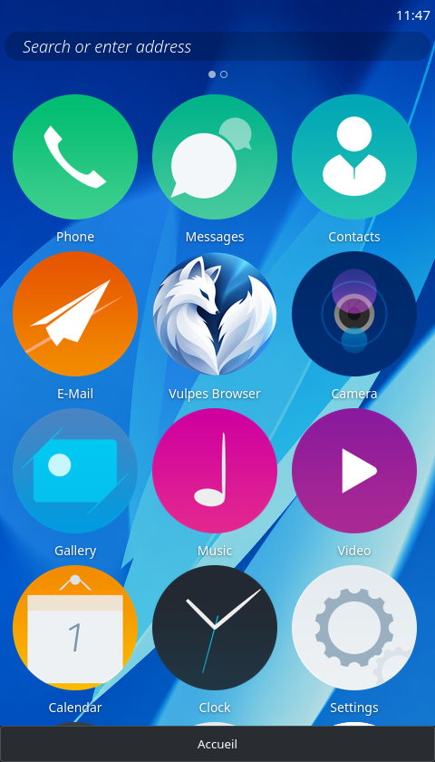
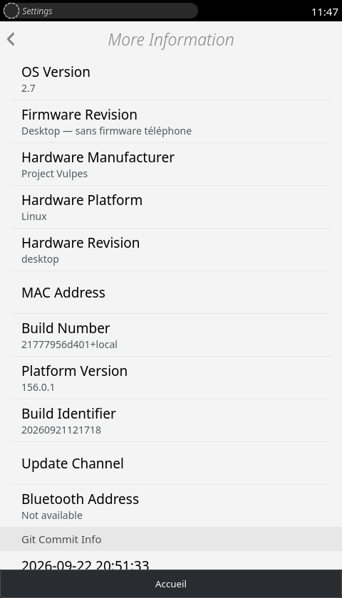

<p align="center">
  <strong lang="en">🇬🇧 English</strong> · <a href="README.fr.md" lang="fr" hreflang="fr">🇫🇷 Français</a>
</p>

<p align="center">
  
</p>

<h1 align="center">Vulpes OS</h1>

<p align="center">
  <strong>The spirit of Firefox OS. Powered by a modern Gecko.</strong><br>
  A community continuation of Firefox OS.
</p>

<p align="center">
  
  
  
  
</p>

<p align="center">
  <a href="https://vulpes-os.org"><strong>🌐 Discover the project</strong></a>
  &nbsp; · &nbsp;
  <a href="#highlights">Highlights</a>
  &nbsp; · &nbsp;
  <a href="#architecture">Architecture</a>
  &nbsp; · &nbsp;
  <a href="#roadmap">Roadmap</a>
</p>

---

## 🦊 The Web as an application platform

What if your phone’s interface were built with the same technologies as your websites?

**Vulpes brings that Firefox OS idea back to life.** The Gaia home screen, settings and applications run on a recent Gecko engine. HTML, CSS and JavaScript remain at the heart of the experience: an interface you can read, understand and modify.

The project connects two generations: **the original Firefox OS interface and applications**, and **the web engine maintained by Mozilla**. The aim is to let one evolve without having to rewrite the other for every release.

> **Publication in progress.** This repository currently presents the project and a screenshot of its prototype. Source code, installation instructions and release builds will follow. The features described below refer to the locally tested development version, not a release available to download here yet.

<p align="center">
  <a href="docs/media/vulpes-desktop.png"></a>
  &nbsp;
  <a href="docs/media/vulpes-gecko.png"></a>
</p>

<p align="center"><em>Home screen and device information — actual desktop captures in English. The “Platform Version” field shows the Gecko version reported by the running engine. Click either image to enlarge it.</em></p>

<a name="highlights"></a>

## ✨ What makes Vulpes interesting

### 🔄 An engine that can keep evolving

Moving from Gecko 45 to 52 was the first step. The desktop prototype now uses **Gecko 156.0.1**, with an architecture that separates the interface, services and engine integration.

An update tool automates downloading a candidate version, checking its checksum and running compatibility tests. Switching versions remains an explicit action, with rollback available. Incompatibilities are detected and documented; they are not repaired automatically.

### 🧩 Keeping Firefox OS applications alive

Vulpes adapts the legacy APIs Gaia needs: settings, the application registry, local contacts, storage and communication between applications. This work covers their behavior, permissions and persistent data.

Tests with archived applications accompany the porting effort. **Compatibility improves one application at a time**: the presence of a legacy API does not yet guarantee that the entire Firefox OS catalog will work.

### 🛠️ Edit the interface without rebuilding Gecko

Much of the interface can be developed directly in HTML, CSS and JavaScript files. Served resources and overrides can be edited and reloaded without recompiling the engine.

Some applications still use bundles produced by the old Gaia build system. Editing them means checking which file is actually loaded: not every file in the historical sources is directly connected to the running interface yet.

### 📱 Two ways to explore the project

- **On Linux:** a phone-sized window with Gaia, multitasking and a browser using separate Gecko views.
- **On Android:** **Vulpes OS – Preview**, a GeckoView application for exploring the experience without replacing your phone’s operating system.

The Android Preview is a testing environment. It is not a ROM and does not replace Android’s telephony features.

## 🧪 Prototype status

| Feature | Linux desktop | Android Preview |
| :--- | :--- | :--- |
| Gaia home screen and application launching | ✅ Working | ✅ Available |
| Persistent settings and translated interface | ✅ Tested workflows | ✅ Integrated; further mobile validation needed |
| Web browsing | ✅ Separate Gecko views | ✅ Separate GeckoView sessions |
| Contacts | ✅ Local to the profile | ✅ Local to Vulpes |
| SMS | 🧪 Interface and local drafts | 🧪 Local interface |
| Gallery and music | ✅ Import and playback tested | 🚧 Android media import still to be ported |
| Alarms | ✅ Creation, delivery and persistence tested | 🧪 Tied to the Vulpes process lifetime |
| Cellular calls and SMS | 🚧 Not integrated | 🚧 Not integrated |
| Installation as a phone operating system | 🚧 Future work | 🚧 The APK does not replace Android |

**Reference versions — September 2026**

| Component | Version |
| :--- | :--- |
| Community product | Vulpes OS 2.7 |
| Desktop engine | Gecko 156.0.1 |
| Android application | Preview 2.7-156.0.1 |
| GeckoView dependency | `156.0.20260921121718` |
| Declared Android minimum | Android 8.0 · API 26 |

The APK, engine and product have separate version numbers. The final `.1` in the Preview version identifies its revision; GeckoView reports **156.0** here. The declared Android minimum does not mean every device has been tested.

<a name="architecture"></a>

## ⚙️ Under the hood

```text
                  Gaia + web applications
                      HTML · CSS · JS
                             │
                 Legacy moz* API compatibility
                  Versioned Vulpes contracts
                             │
       Settings · Applications · Contacts · Storage
                  Local messages · Alarms
                             │
               ┌─────────────┴─────────────┐
               │                           │
         Desktop host                 Android host
       Privileged window           GeckoView + bridge
      and separate web views       WebExtension/native
               │                           │
        Firefox / Gecko                 GeckoView
               │                           │
             Linux                       Android
```

### A clear boundary between applications and the system

Applications use services whose permissions are checked by the host. External web pages use separate browsing contexts and do not receive Vulpes’s privileged APIs.

The current desktop port uses the **official Firefox binary**, with a Vulpes host and adapters, without native engine patches. Some interfaces used by this host remain internal to Gecko, making tests essential whenever the engine version changes.

### Updates checked before activation

```text
Download → Verify checksum → Test engine interfaces
                                      ↓
Keep old engine ← Activate ← Test Gaia and persistence
```

Test profiles are separate from user data. The tool keeps the previous engine and its profile to allow rollback. This pipeline currently covers the desktop; Android updates follow the APK build cycle.

### A tested development base

Automated checks cover, among other things:

- booting the actual Gaia interface and loading application icons;
- languages, settings and persistence across restarts;
- contacts, the dial pad and the SMS composer;
- imported media, alarms and web browsing;
- rejecting access when the origin or permissions do not match.

An export of the files planned for publication also booted and passed the desktop tests without the old development directories. Android asset packaging and APK compilation have been verified. This is not exhaustive validation of Firefox OS or every Android phone.

<a name="roadmap"></a>

## 🗺️ What’s next

- **Publish a self-contained base:** source code, licenses, documentation and startup instructions.
- **Strengthen compatibility:** continue testing historical applications and improving everyday workflows.
- **Improve the Android Preview:** media access, platform integration and feedback from real devices.
- **Reduce Gecko update maintenance:** keep service contracts stable and limit engine-specific adaptations.
- **Explore a full mobile port:** hardware, modem, drivers and system integration once the foundation is ready.

## 🤝 Get involved

Useful reports include **the device or Linux distribution, the version in use, steps to reproduce the issue and the expected result**. A screenshot and a log excerpt without personal data help a lot.

The project also welcomes work on JavaScript, CSS, Gecko/GeckoView integration, testing, translation and documentation. Contribution guidelines will accompany the source release.

## 📜 Origins and licenses

Vulpes builds on the work of Mozilla and the contributors to **Boot to Gecko / Firefox OS**, including Gaia.

The license selected for new Vulpes files is the **Mozilla Public License 2.0 (`MPL-2.0`)**. Gaia and other inherited components retain their own licenses, including **Apache 2.0** for the Gaia base, along with their attribution notices. License texts and component details will accompany the source release.

---

<p align="center">
  <strong>VULPES</strong><br>
  Firefox OS Community Project<br><br>
  <a href="https://vulpes-os.org">vulpes-os.org</a>
</p>

<p align="center">
  <sub>Vulpes is an independent community project and is not affiliated with or endorsed by Mozilla.</sub>
</p>
