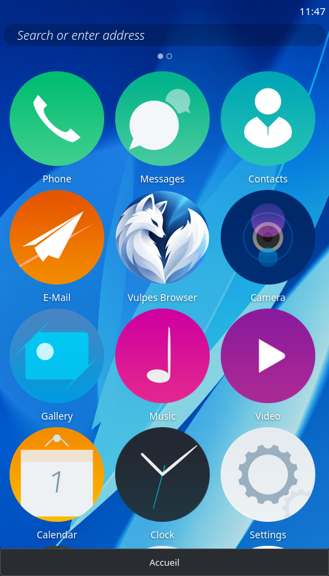

<p align="center"><strong>English</strong> · <a href="https://nnsprod.com/git/oversu/VulpesOS/src/branch/main/README.fr.md">Français</a></p>
<p align="center"></p>
<h1 align="center">Vulpes OS</h1>
<p align="center">Firefox OS fork · Open source</p>

<p align="center">
<a href="https://nnsprod.com/git/oversu/VulpesOS/releases"></a>


</p>
<p align="center">
<a href="https://nnsprod.com/git/oversu/VulpesOS/releases"></a>
<a href="#linux"></a>
<a href="https://vulpes-os.org/devices/pixel-3a.php?lang=en"></a>
<a href="https://vulpes-os.org/devices/pixel-3a.php?lang=en"></a>
</p>

[Website](https://vulpes-os.org/?lang=en) · [Downloads](https://nnsprod.com/git/oversu/VulpesOS/releases) · [Changelog](CHANGELOG.en.md) · [Report a bug](https://nnsprod.com/git/oversu/VulpesOS/issues)

Vulpes OS picks up where Firefox OS left off, adapting **Gaia**, its interface and HTML/CSS/JavaScript applications, to run on a recent **Gecko** engine.

I’m OverSu, and I develop Vulpes mostly on my own, with help from people who test and contribute to the project. **Vulpes is free and open source, and will stay that way.** There are no plans for subscriptions or paid features.

<p align="center"></p>
<p align="center"><em>The Gaia home screen in the desktop version.</em></p>

## Try Vulpes

| Platform | How to use it |
| --- | --- |
| **Linux** | Run Gaia from source to explore the interface or develop applications. |
| **Android** | Install the [APK from the releases page](https://nnsprod.com/git/oversu/VulpesOS/releases). It runs as an Android application and does not replace your phone’s operating system. |
| **Google Pixel 3a · Sargo** | Run Vulpes as a native operating system with Tundra. A downloadable image is still being prepared; see the [device page](https://vulpes-os.org/devices/pixel-3a.php?lang=en) for tested features and known limitations. |

On the Pixel 3a, **Tundra boots Gecko and Gaia directly** and provides access to the hardware. Droidian was used as a testing environment early in development. It is not included in Vulpes OS, and Tundra is not based on it.

### Linux

You’ll need Linux x86_64, Git, Python 3 and the system libraries required by Firefox.

```sh
git clone https://nnsprod.com/git/oversu/VulpesOS.git
cd VulpesOS
./setup.sh
./run.sh
```

`setup.sh` downloads the Gecko engine selected for this version and verifies its checksum.

### Build the APK

From the repository root:

```sh
cd android
./build-apk.sh
```

The development APK is created in `android/dist/`. A personal build uses its own signing key, so it cannot update an APK signed with the project’s key.

## Contribute

You can test Vulpes, [report an issue](https://nnsprod.com/git/oversu/VulpesOS/issues), improve translations or contribute code. When reporting a bug, include your platform, the version you’re using and the steps to reproduce it.

Development updates and test results are in the [changelog](CHANGELOG.en.md). If you’d like to help cover project costs, the [Support me](https://vulpes-os.org/support.php?lang=en) page explains what your contribution supports.

## Credits and licenses

Thanks to Mozilla, Gaia contributors, Capyloon, Droidian, UBports, libhybris, Debian and AOSP for the code, tools and work that have helped this project.

New Vulpes code is licensed under **MPL 2.0**. Gaia retains its **Apache 2.0** license; other components retain their own licenses and notices. See [LICENSE](LICENSE), [NOTICE](NOTICE) and [Gaia’s license](gaia/LICENSE).

Vulpes OS is an independent project by **OverSu / NNS Production**, with no affiliation with Mozilla.
